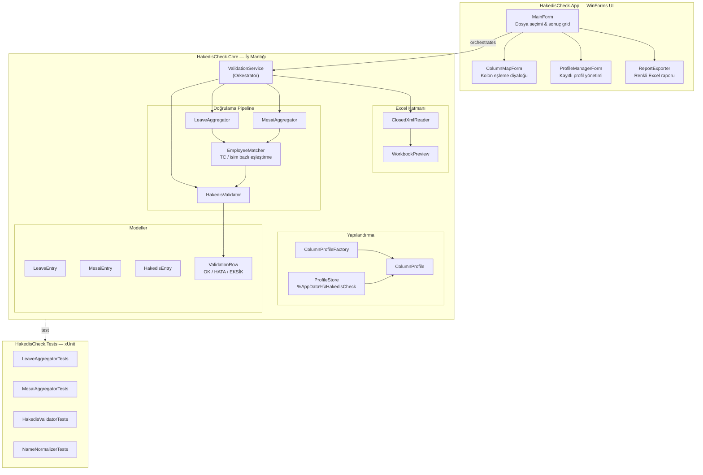
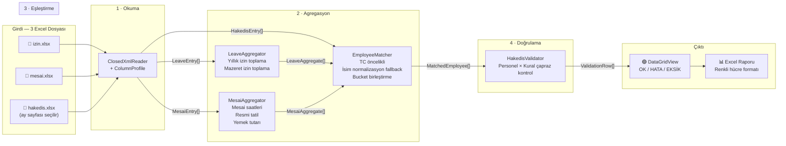
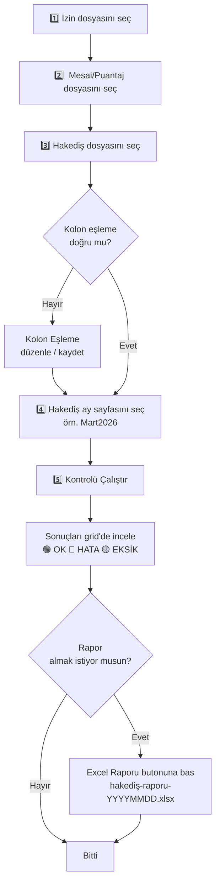
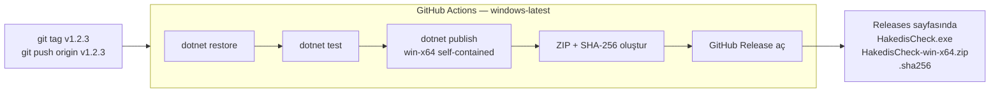

# HakedisCheck

<p align="center">
  <a href="https://github.com/murataslan1/hakedis-check/releases/latest">
    
  </a>
  <a href="https://github.com/murataslan1/hakedis-check/releases/latest">
    
  </a>
  
  
  <a href="https://github.com/murataslan1/hakedis-check/actions">
    
  </a>
</p>

<p align="center">
  Alt yüklenici hakediş dosyalarını izin ve mesai Excel'leriyle karşılaştırarak tutarsızlıkları otomatik bulan Windows masaüstü uygulaması.
</p>

---

## İçindekiler

- [Ne İşe Yarar?](#ne-işe-yarar)
- [Hızlı Başlangıç — EXE İndir](#hızlı-başlangıç--exe-indir)
- [Mimari](#mimari)
- [Veri Akışı](#veri-akışı)
- [Proje Yapısı](#proje-yapısı)
- [Uygulama Nasıl Kullanılır](#uygulama-nasıl-kullanılır)
- [Kolon Profilleri](#kolon-profilleri)
- [Doğrulama Kuralları](#doğrulama-kuralları)
- [Geliştirici Kurulumu](#geliştirici-kurulumu)
- [Testler](#testler)
- [CI / Otomatik Release](#ci--otomatik-release)

---

## Ne İşe Yarar?

Aynı aya ait üç Excel dosyası arasındaki tutarlılığı kontrol eder:

| Dosya | İçerik |
|---|---|
| **İzin Listesi** | Personel yıllık izin ve mazeret izin kayıtları |
| **Mesai / Puantaj** | Fazla mesai saatleri, resmi tatil mesaisi, yemek tutarı |
| **Hakediş** | Alt yüklenicinin sunduğu ödeme talebi |

Her personel için şu karşılaştırmalar yapılır:

- Yıllık izin gün sayısı
- Fazla mesai saati
- Resmi tatil fazla mesai saati
- Yemek tutarı (kolon eşlenmişse)

Sonuç her satır için `OK` / `HATA` / `EKSİK` olarak raporlanır. Renkli Excel raporu da üretilebilir.

---

## Hızlı Başlangıç — EXE İndir

> **Windows 10 / 11** — .NET kurulumu gerekmez.

1. [**Releases** sayfasına git](https://github.com/murataslan1/hakedis-check/releases/latest)
2. `HakedisCheck.exe` dosyasını indir
3. Çift tıkla, çalıştır

SHA-256 doğrulaması için `HakedisCheck-win-x64.exe.sha256` dosyasını kullanabilirsin.

---

## Mimari



---

## Veri Akışı



---

## Proje Yapısı

```
hakedis-check/
├── HakedisCheck.sln
│
├── HakedisCheck.App/               # WinForms UI katmanı
│   ├── MainForm.cs                 # Ana pencere — dosya seçimi, grid, durum çubuğu
│   ├── ColumnMapForm.cs            # Kolon eşleme diyaloğu
│   ├── ProfileManagerForm.cs       # Kayıtlı profil listeleme / seçme
│   ├── ReportExporter.cs           # Renkli Excel raporu üretimi
│   └── Program.cs
│
├── HakedisCheck.Core/              # Saf iş mantığı (UI bağımlılığı yok)
│   ├── Excel/
│   │   ├── ClosedXmlReader.cs      # ClosedXML ile satır okuma
│   │   ├── WorkbookPreview.cs      # Sayfa adları + ön izleme
│   │   └── RowData.cs / PreviewRow.cs / WorksheetPreview.cs
│   ├── Config/
│   │   ├── ColumnProfile.cs        # Mantıksal alan → Excel kolon eşlemesi
│   │   ├── ColumnProfileFactory.cs # Otomatik profil öneri motoru
│   │   ├── ProfileStore.cs         # JSON profil kayıt/yükleme (%AppData%)
│   │   └── ProfileSchema.cs
│   ├── Models/                     # Domain modelleri
│   │   ├── LeaveEntry / MesaiEntry / HakedisEntry
│   │   ├── ValidationRow.cs
│   │   ├── ValidationStatus.cs     # OK / Hata / Eksik
│   │   ├── LogicalField.cs         # Mantıksal alan enum'ı
│   │   └── ExcelFileKind.cs
│   ├── Aggregation/
│   │   ├── LeaveAggregator.cs      # İzin kayıtlarını personel bazında toplar
│   │   └── MesaiAggregator.cs      # Mesai verilerini personel bazında toplar
│   ├── Matching/
│   │   ├── EmployeeMatcher.cs      # TC kimlik öncelikli çoklu kaynak eşleştirme
│   │   ├── NameNormalizer.cs       # Türkçe büyük/küçük harf normalizasyonu
│   │   └── MatchedEmployee.cs
│   ├── Comparison/
│   │   └── HakedisValidator.cs     # 4 kural × personel karşılaştırma motoru
│   ├── Processing/
│   │   ├── ValidationService.cs    # Tüm pipeline'ı yöneten orkestratör
│   │   ├── ValidationRunOptions.cs
│   │   └── ValidationRunResult.cs
│   └── Utilities/
│       ├── TextUtilities.cs
│       └── ValueParser.cs          # Türkçe sayı / saat formatı çözümleme
│
├── HakedisCheck.Tests/             # xUnit birim testleri
│   ├── Aggregation/
│   ├── Comparison/
│   └── Matching/
│
└── .github/workflows/
    └── release.yml                 # Tag push → otomatik EXE release
```

---

## Uygulama Nasıl Kullanılır



### Sonuç Renk Kodları

| Durum | Renk | Açıklama |
|---|---|---|
| **OK** | Açık yeşil | Beklenen değer hakediş ile eşleşiyor |
| **HATA** | Açık kırmızı | Değerler arasında fark var |
| **EKSİK** | Sarı | Personel bir dosyada bulunamadı |

---

## Kolon Profilleri

Her şirketin Excel formatı farklıdır. HakedisCheck bu sorunu **profil** sistemiyle çözer:

- Dosyayı seçtiğinde uygulama otomatik profil önerisi üretir (kolon başlıklarından çıkarım)
- **Kolon Eşleme** diyaloğundan başlık satırı, veri başlangıç satırı ve kolonlar düzenlenebilir
- Profil kaydedilirse `%AppData%\HakedisCheck\profiles` klasörüne JSON olarak yazılır
- Bir sonraki çalıştırmada **Profiller** butonu ile aynı profil yüklenebilir

---

## Doğrulama Kuralları

`HakedisValidator` her personel için şu dört kontrolü çalıştırır:

| Kontrol | Kaynak | Hakediş Kolonu |
|---|---|---|
| Yıllık İzin (Gün) | İzin dosyası → `LeaveAggregator` | `UsedAnnualLeaveDays` |
| Fazla Mesai (Saat) | Mesai dosyası → `MesaiAggregator` | `OvertimeHours` |
| Resmi Tatil FM (Saat) | Mesai dosyası → `MesaiAggregator` | `HolidayOvertimeHours` |
| Yemek Tutarı (TL) | Mesai dosyası → `MesaiAggregator` | `MealAmount` (opsiyonel) |

**Personel eşleştirme önceliği:** TC kimlik numarası (11 hane) → normalize edilmiş isim. Farklı dosyalarda TC veya isim farklılığı olduğunda bucket birleştirme algoritması devreye girer.

---

## Geliştirici Kurulumu

### Gereksinimler

- Windows 10 / 11
- [.NET 8 SDK](https://dotnet.microsoft.com/download/dotnet/8.0) **veya** Visual Studio 2022 (`.NET desktop development` workload)

### Klonla ve Çalıştır

```bash
git clone https://github.com/murataslan1/hakedis-check.git
cd hakedis-check
dotnet run --project HakedisCheck.App/HakedisCheck.App.csproj
```

### Visual Studio ile

1. `HakedisCheck.sln` dosyasını Visual Studio ile aç
2. `Solution Explorer` → `HakedisCheck.App` → sağ tık → **Set as Startup Project**
3. `F5` ile çalıştır

> **Not:** `A project with an output type of Class Library cannot be started directly` hatası görürsen başlangıç projesi yanlış seçilmiştir; `HakedisCheck.App` projesini `Startup Project` yap.

### Self-Contained EXE Üretmek

```bash
dotnet publish HakedisCheck.App/HakedisCheck.App.csproj \
  -c Release -r win-x64 --self-contained true \
  -p:PublishSingleFile=true -o publish/win-x64
```

Çıktı: `publish\win-x64\HakedisCheck.exe` — hedef makinede .NET kurulumu gerekmez.

---

## Testler

```bash
dotnet test HakedisCheck.Tests/HakedisCheck.Tests.csproj
```

Test kapsamı:

| Test Dosyası | Ne Test Eder |
|---|---|
| `LeaveAggregatorTests` | Yıllık izin / mazeret ayrımı ve toplama |
| `MesaiAggregatorTests` | Mesai saat ve yemek tutarı agregasyonu |
| `HakedisValidatorTests` | OK / HATA / EKSİK senaryoları |
| `NameNormalizerTests` | Türkçe karakter ve büyük/küçük harf normalizasyonu |

---

## CI / Otomatik Release



Yeni sürüm çıkarmak için:

```bash
git tag v0.2.0
git push origin v0.2.0
```

GitHub Actions otomatik olarak testleri çalıştırır, EXE üretir ve Releases sayfasına yükler.

---

## Notlar

- Örnek Excel dosyaları repoya dahil edilmedi.
- WinForms .NET projenin yapısı yalnızca Windows için hazırlandı. macOS'ta `WindowsDesktop SDK` olmadığından WinForms projesi doğrudan derlenmez; build/publish işlemini Windows'ta yapman gerekir.
